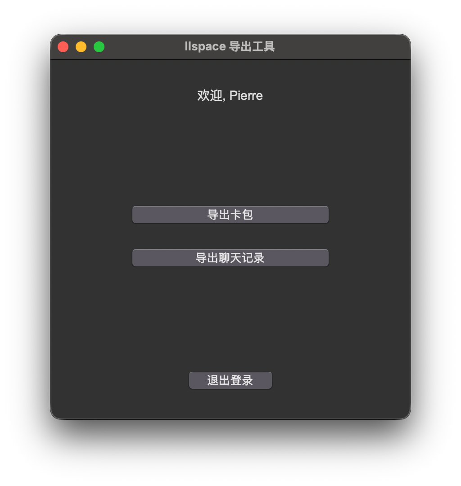
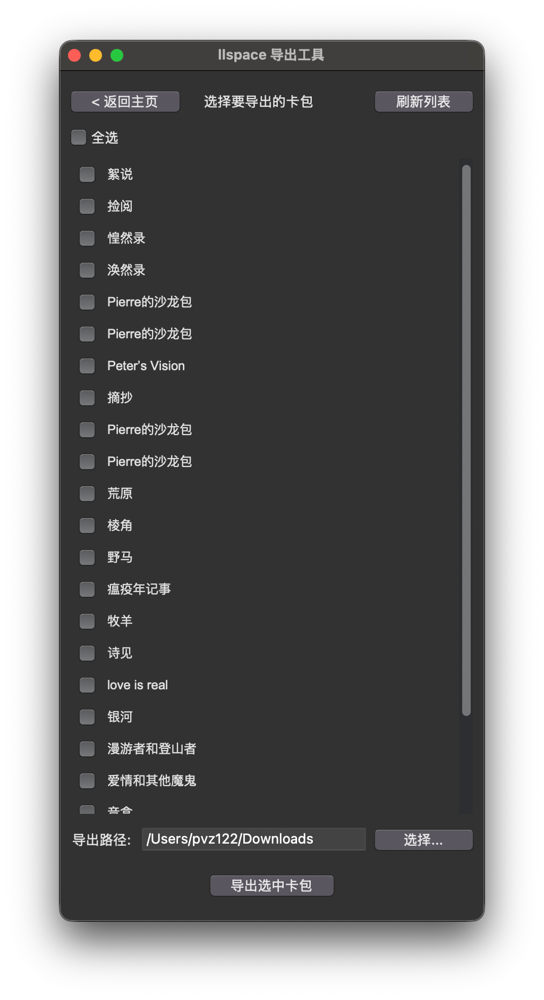
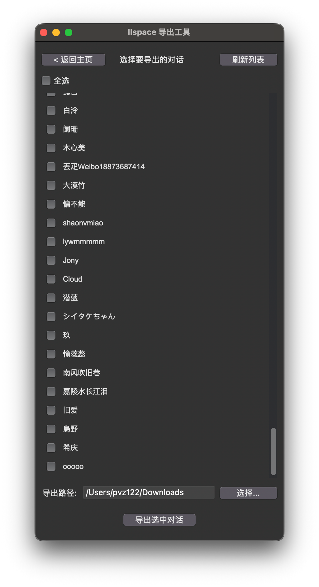
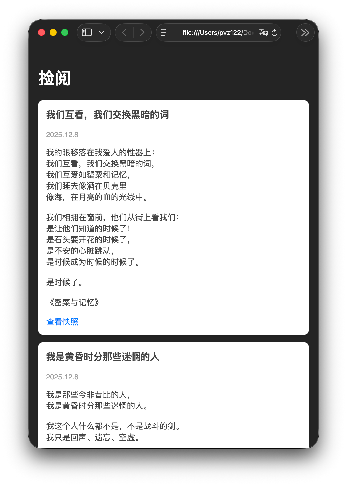
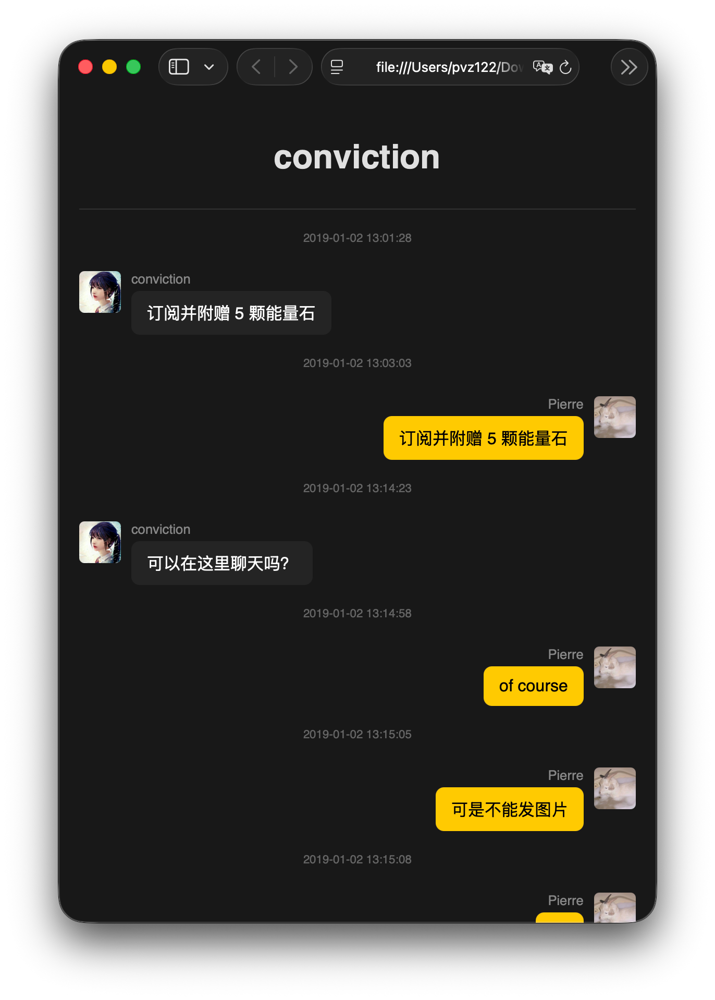

# llspace 平行世界导出工具

这是一个用于从 llspace 平行世界 导出用户卡片内容的桌面 GUI 工具。它可以帮助你将卡包和聊天记录中的内容备份到本地，支持导出为 Markdown 和 HTML 格式，并自动下载相关图片。

## 安装与运行

### 方式一：下载可执行文件 (推荐)

1.  访问本仓库的 [Releases 页面](https://github.com/pvz122/llspace_export/releases)。
2.  根据你的操作系统下载对应的可执行文件：
    *   **Windows**: 下载 `_win.exe` 文件。
    *   **macOS**: 下载`_mac`二进制文件。
    *   **Linux**: 下载 `_linux` 二进制文件。
3.  双击运行下载的文件即可启动程序。（macOS 可能需要在“系统偏好设置”中允许打开未认证的应用）

### 方式二：直接运行源码

1.  **克隆或下载代码**到本地。

2.  **初始化环境**：
    确保已安装 `uv`，然后在项目根目录下运行：
    ```bash
    uv sync
    ```

3.  **运行程序**：
    ```bash
    uv run main.py
    ```

### 方式三：自行打包可执行文件

如果你想生成一个独立的可执行文件（如 `.exe` 或 `.app`），可以使用内置的构建脚本。

1.  **安装依赖**：
    ```bash
    uv sync
    ```

2.  **运行构建脚本**：
    ```bash
    uv run build.py
    ```

3.  **查找程序**：
    构建完成后，可执行文件将生成在 `dist` 目录下。
    *   **Windows**: `dist/llspace-exporter.exe`
    *   **macOS**: `dist/llspace-exporter.app` (或二进制文件)
    *   **Linux**: `dist/llspace-exporter`

## 使用指南

1.  **登录**：
    *   启动程序后，输入你的 llspace 用户名和密码（如果你用的是微信、微博等第三方登录，请先在官方客户端设置密码）。
    *   点击“登录”按钮。

2. **选择导出功能**：
    *   登录成功后，主界面会显示两个按钮：“导出卡包”和“导出聊天记录”。
    *   选择“导出卡包”进入卡包导出流程，选择“导出聊天记录”进入聊天记录导出流程。
    

3.  **导出卡包**：
    *   界面会显示你账号下的所有卡包列表。
    *   勾选你想要导出的一个或多个卡包。
    *   点击底部的“导出选中卡包”按钮。
    *   程序将开始下载并处理数据。界面上会显示当前的导出进度。
    

4.  **导出聊天记录**：
    *   界面会显示你账号下的所有聊天对话列表。
    *   勾选你想要导出的一个或多个对话。
    *   点击底部的“导出选中对话”按钮。
    *   程序将开始下载并处理数据。界面上会显示当前的导出进度。
    

5.  **查看结果**：
    *   导出的文件默认保存在“下载”目录下。
    *   卡包的结构如下：
        ```
        卡包名_1735647600/
        ├── images/          # 封面图片
        ├── web/             # 网页快照
        ├── media/           # 音频文件
        ├── 卡包名.md         # Markdown 内容文件
        └── index.html       # 网页文件
        ```
        点击打开 `index.html` 可在浏览器中查看完整内容：
        
    *   聊天记录的结构如下：
        ```
        对话名/
        ├── cards/           # 卡片网页快照
        ├── 对话名.md        # Markdown 文件
        ├── 对话名.html      # HTML 文件
        └── 对话名.json      # JSON 文件
        ```
        打开 `.html` 文件可在浏览器中查看聊天记录：
        

6.  **关闭程序**：
    *   导出完成后，可以直接关闭程序窗口。
    *   如果需要切换账号，点击主界面右上角的“退出登录”按钮即可清除本地缓存并返回登录界面。

## 开发说明

*   `main.py`: 程序入口。
*   `build.py`: PyInstaller 打包脚本。
*   `src/gui.py`: 图形界面实现 (Tkinter)。
*   `src/api_client.py`: llspace API 客户端。
*   `src/cards_exporter.py`: 卡包导出逻辑核心。
*   `src/chat_exporter.py`: 聊天记录导出逻辑核心。
*   `src/utils.py`: 通用工具函数。
*   `src/config.py`: 配置文件。

## 免责声明

1.  本工具仅供学习和个人备份使用，请勿用于任何商业用途或非法用途。
2.  本仓库与 **llspace 平行世界** 官方无关。
3.  本工具**不存储**任何用户的账号、密码或隐私数据。所有数据仅保存在用户本地计算机上。
4.  使用本工具产生的任何后果由用户自行承担。

## 许可证

MIT License
